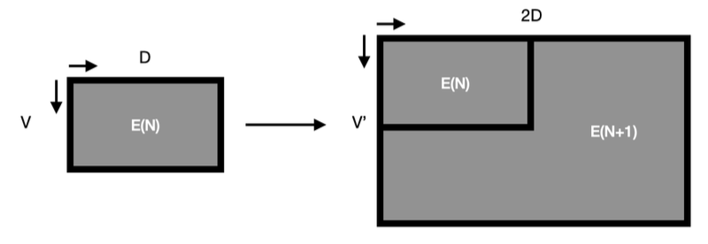

# Curriculum Learning with RoBERTa

Human brain is developing gradually. New connections are established between the neurons and the perception of already acquired knowledge is subject to change. Therefore, one can conclude that the learning process of humans involves first capturing the essence of the subject and then delving into its deeper intricacies and complexities. Having the motivation from this natural learning process, I developed three RoBERTa models for each learning phase with different parameter sizes. From the HuggingFace transformers library I used RobertaForMaskedLM as the template model and used ByteLevelBPETokenizer from tokenizers library to create a customized tokenizer. You can find the model and training related hyperparameters at in the following Table.

| **Parameter**       | **Phase 1** | **Phase 2** | **Phase 3** |
|---------------------|-------------|-------------|-------------|
| **voc_size**        | 5334        | 15334       | 30334       |
| **# of layers**     | 3           | 6           | 12          |
| **hidden size**     | 192         | 384         | 768         |
| **FFN in. hid. s.** | 768         | 1536        | 3072        |
| **# of self-att_h** | 3           | 6           | 12          |
| **att. head size**  | 64          | 64          | 64          |
| **dropuut**         | 0.1         | 0.1         | 0.1         |
| **att. dropout**    | 0.1         | 0.1         | 0.1         |
| **batch size**      | 64          | 64          | 32          |
| **epochs**          | 10          | 5           | 5           |
| **max seq. len.**   | 512         | 512         | 512         |
| **acc. steps**      | 4           | 4           | 4           |
| **mlm prob.**       | 0.15        | 0.15        | 0.15        |
| **optimizer**       | AdamW       | AdamW       | AdamW       |
| **scheduler**       | lin.        | lin.        | lin.        |
| **max lr.**         | 5e-5        | 5e-5        | 5e-5        |

The reason behind the choice of byte level BPE tokenization is that it is more intuitive to initially learn the most common character combinations appearing together and also the original RoBERTa model (Liu et al., 2019) used this tokenization. Due to the compatibility issues, I converted this customised tokenizer to RobertaTokenizer. During the transition between the phases, the parameters of the previous model is copied to related positions at the subsequent model. The following Figure illustrates the general idea used for initializing the parameters of the following model.

This method is applied for each one of the embedding layer, encoder layers (for the ones that existed in the previous model), and language model head layer parameters. Differing from the oth- ers parameter sets, I used a special initialization technique for the word embeddings and the de- coder of the language model head layer. The idea behind this method is that the token which is obtained from the combination of two subtokens would carry similar information to both of the tokens that it is constructed from. This may be not useful for the first some number of merges as they are likely to carry generic information in their embeddings, but after a number of merges, it is likely that the embeddings of the subtokens can be a good starting point for the new tokens.
To achieve the mentioned operations and to have a consistency between the previous and subsequent models, the construction of the tokenizer plays a significant role. For a new phase, the new model is created with an extended vocabulary. The token indices of the previous model must remain the same for the next model so that the initialization method that I mentioned make sense. To achieve that, I applied the byte level BPE to the same training corpus which is composed of all training files.
I increased the number of self-attention heads proportional to the hidden size (word embedding size). The idea behind this choice is again ensuring the compatibility between the previous and next model. During the training of a model, each attention head focuses on a specific part of the word embeddings. Therefore by increasing the number of heads proportional to the embedding size, I aimed to keep the attention head size constant between the phases. Thus, even though the results of each head is affected from the dimensional increase in the input, at least the portion of the input vector inherited from the previous phase interacts with the attention parameters of it.

## Notebook

The provided notebook contains the code necessary to create a language model
based on a specified data, using curriculum learning. 

### IMPORTANT NOTE:

The file paths in the project code need to be adjusted if you want to run the code.
Necessary explanations are provided next to these lines.

Here is the necessary explanation regarding the functions defined in the
notebook:

### get_tokenizer():
This function receives the phase as its input and constructs the tokenizer 
based on the hardcoded vocabulary sizes, using the same data files for each phase
to ensure the vocabulary consistency between each phase.

### init_model_and_tokenizer():
Receives the phase as the argument and returns the model whose parameters are
determined according to the phase, together with the tokenizer.

### merge_typeN():
Used for calculating the parameters of the next model based on the previous model.
Type 4 is specifically used for calculating the embedding and 
decoder matrices. The details are provided in the paper.

### prepare_embedding_and_out_layer():
Using merge_typeN() functions, calculates and sets the "embedding" and "lm_head"
parameters of the new RobertaForMaskedLM model based on the model from previous phase.

### prepare_encoder_layer():
Using merge_typeN() functions, iterates over the stacked encoder layers,
calculates and sets the "encoder" parameters of the
new RobertaForMaskedLM model based on the model from previous phase.

### prepare_model_for_new_phase():
Interface for the user to adjust the parameters of the new model.
Calls prepare_encoder_layer() and prepare_embedding_and_out_layer() functions.

### preprocess_file():
Taking the current tokenizer as input, splits the lines which are longer than a
hardcoded number of tokens, constructs a new datafile with new lines, returns the
new path

### train_model():
Trains a given model on the specified training files for the MLM task. Saves the
model after each epoch if the file path is provided.

## USAGE:

- Initialize the first model and tokenizer
- The first model is not passed to prepare_model_for_new_phase() because this is the
first model to be trained.
- Train the first model with specified training files (for phase 1)
- Initialize the second model and its tokenizer.
- Prepare the second model for new phase using the previous model (first model)
- Train the second model with specified training files (for phase 2)
- Initialize the third model and its tokenizer.
- Prepare the third model for new phase using the previous model (second model)
- Train the third model

In the provided code, after being trained, models are saved to a desired location
for further use.

Check the notebook and the paper for more details.
